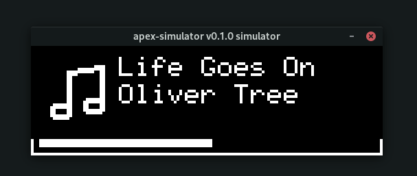
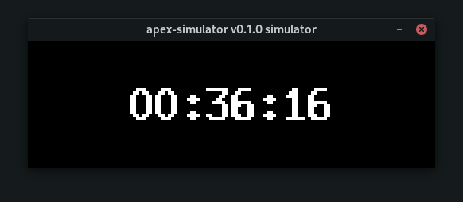
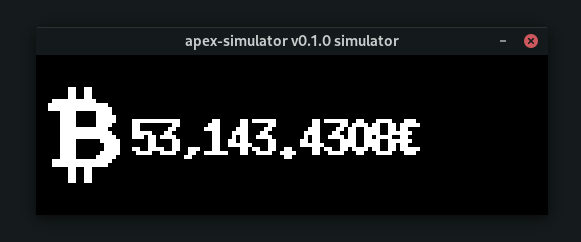
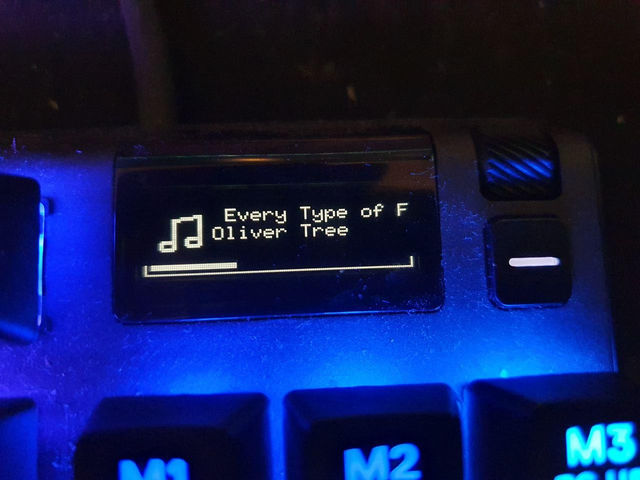
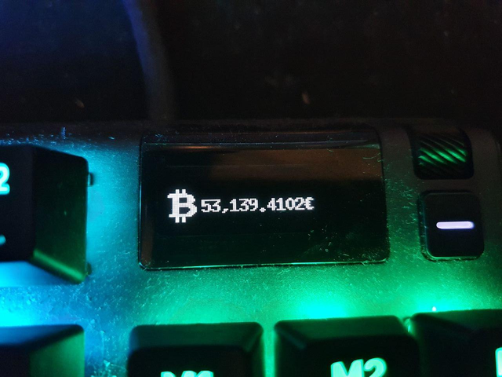

# apex-tux - Linux support for the Apex series OLED screens

Make use of your OLED screen instead of letting the SteelSeries logo burn itself in :-)

## Screenshots





 


## Features
- Music player integration (requires DBus)
- Discord notifications (requires DBus)
- Bitcoin price
- Clock
- Scrolling text
- No burn-in from constantly displaying a static image

## Supported media players
- [Lollypop](https://gitlab.gnome.org/World/lollypop) (tested)
- Firefox (Results may vary)
- Chromium / Chrome (Results may vary)
- mpv
- Telegram
- VLC
- Spotify

Source: [Arch Wiki](https://wiki.archlinux.org/title/MPRIS#Supported_clients)

## Supported devices
This currently supports the following devices:
- Apex Pro
- Apex 7 (untested)

Other devices may be compatible and all that is needed is to add the ID to apex-hardware/src/usb.rs. 

## Installation

### UDev

Enter the following data from [here](https://gist.github.com/ToadKing/d26f8f046a3b707e9e4b9821be5c9efc) (Shoutout to @ToadKing).

### Rust

- Install Rust **nightly** using [rustup](https://rustup.rs/)
- Clone the repository: `git clone git@github.com:not-jan/apex-tux.git`
- Change directory into the repository: `cd apex-tux`
- Compile the app using the features you want
  - If you **don't** run DBus you have to disable the dbus feature: `cargo build --release --no-default-features --features crypto,usb`
  - Otherwise just run `cargo build --release`
  - If you **don't** have an Apex device around at the moment or want to develop more easily you can enable the simulator: `cargo build --release --no-default-features --features crypto,clock,dbus-support,simulator`
    
## Configuration
The default configuration is in settings.toml.
This repository ships with a default configuration that covers most parts and contains documentation for the important keys. 

## Usage

Simply run the binary under `target/release/apex-tux` and make sure the settings.toml is in your current directory.
The output should look something like this: 
```
23:18:14 [INFO] register hotkey ALT+SHIFT+A
23:18:14 [INFO] register hotkey ALT+SHIFT+D
23:18:14 [INFO] Registering Coindesk display source.
23:18:14 [INFO] Registering Clock display source.
23:18:14 [INFO] Registering MPRIS2 display source.
23:18:14 [INFO] Registering DBUS notification source.
23:18:14 [INFO] Found 3 registered providers
23:18:14 [INFO] Trying to connect to DBUS with player preference: Some("Lollypop")
23:18:18 [INFO] Trying to connect to DBUS with player preference: Some("Lollypop")
23:18:18 [INFO] Connected to music player: "org.mpris.MediaPlayer2.Lollypop"
23:34:01 [INFO] Ctrl + C received, shutting down!
23:34:01 [INFO] unregister hotkey ALT+SHIFT+A
23:34:01 [INFO] unregister hotkey ALT+SHIFT+D
```

You may change sources by pressing **Alt+Shift+A** or **Alt+Shift+D** (This might not work on Wayland). The simulator uses the arrow keys.

## Development

If you have a feature to add or a bug to fix please feel free to open an issue or submit a pull request.

## TODO:
- Windows support
- Test this on more than one Desktop Environment on X11
- More providers
  - System metrics?
  - Games?
  - GIFs?
- Change the USB crate to something async instead
- Add documentation on how to add custom providers
- Switch from GATs to async traits once there here
- Add support for more notifications
- Package this up for Debian/Arch/Flatpak etc.

## Windows support ETA wen?
I've written a stub for SteelSeries Engine support on Windows, there is an [API for mediaplayer metadata](https://microsoft.github.io/windows-docs-rs/doc/windows/Media/Control/struct.GlobalSystemMediaTransportControlsSessionManager.html) but my time is kind of limited and I don't run Windows all that often. 
It will happen eventually but it's not a priority.

## Why nightly Rust?
Way too many cool features to pass up on :D 

